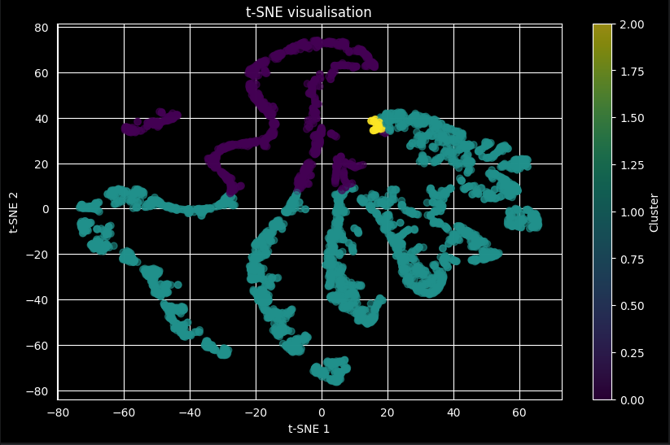
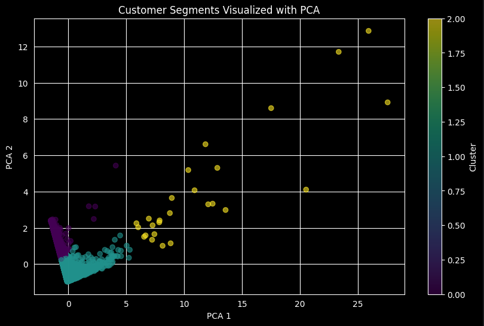
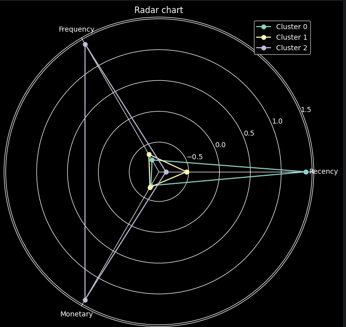

# Retail Behaviour Clustering

Customer segmentation project based on the **UCI Online Retail Dataset**.

The goal of the project is to group online retail customers based on their purchasing behaviour using unsupervised machine learning methods.

## Project Scope

The project includes:

* data cleaning and preprocessing,
* creating RFM features:

  * Recency,
  * Frequency,
  * Monetary,
* selecting the number of clusters using the elbow method,
* customer clustering with K-Means,
* cluster analysis,
* clustering stability check,
* visualisations using PCA, t-SNE and radar charts.

## Results

## Technologies

* Python
* pandas
* NumPy
* scikit-learn
* matplotlib
* seaborn
* Jupyter Notebook

## Files

* `notebook.ipynb` — main analysis
* `experiment_including_cancellations.ipynb` — additional experiment
* `requirements.txt` — required libraries
* `data/` — dataset files

## Authors

* Patrycja Jaworska
* Mateusz Paszyński

## License

MIT License
